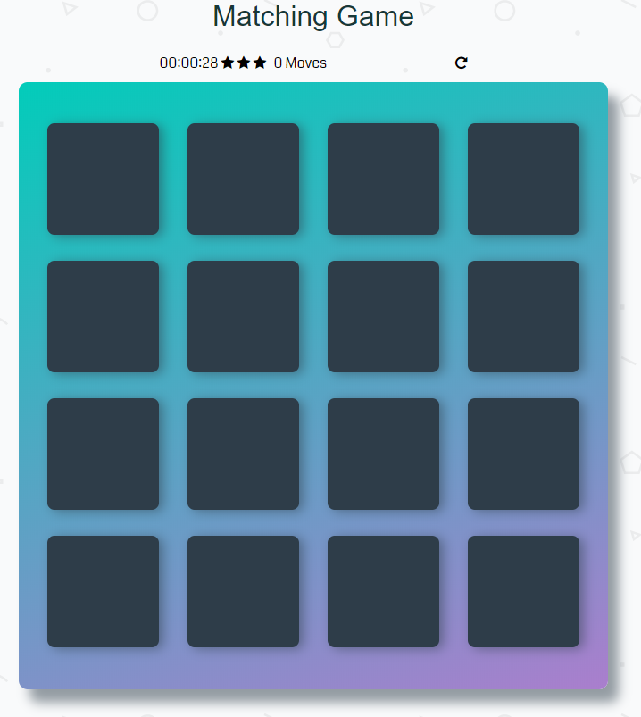

# Memory Game Project

## How to run the game in your PC?
1. Click 'Clone or download' button, click 'DOWNLOAD ZIP'
2. Open downloaded folder, open 'index.html' to run the game

## How the game works?
The game consists of sixteen "cards" arranged in a grid. The deck is made up of eight different pairs of cards, each with different symbols on one side. The cards are arranged randomly on the grid with the symbol face down.

## Gameplay rules

Rules are very simple:

- Flip over two hidden cards at a time to locate the ones that match!

Each turn:

- You will flip one card over to reveal its underlying symbol.
- Turns over a second card, trying to find the corresponding card with the same symbol.
- If the cards match, both cards stay flipped over.
- If the cards do not match, both cards are flipped face down.

Good Luck! Find all the pair :)

